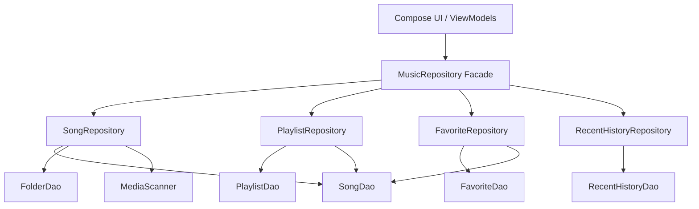

# Data Layer Consolidation & Repository Normalization Report (Phase R8)

This report details the repository restructuring, mapper consolidation, DAO audit, cache audit, and coroutine audit implemented in Phase R8 to resolve architectural complexity and duplicate responsibilities in the data layer.

---

## 1. Repository Dependency Graph

---

## 2. Repository Responsibilities

Following the Single Responsibility Principle, each repository now governs exactly one domain context:

- **`SongRepository`**: Owns scanned local songs, directory folders, local disk media scanning triggers, and play count increments.
- **`PlaylistRepository`**: Owns playlist creation, deletions, song ordering, and additions/removals.
- **`FavoriteRepository`**: Owns adding/removing songs to user favorites.
- **`RecentHistoryRepository`**: Owns adding and querying the chronological listening log.
- **`MusicRepository`**: Re-purposed as a facade/adapter using the **Strangler Pattern**. It injects the 4 single-responsibility sub-repositories and delegates all calls to them. This ensures complete backwards-compatibility and prevents any compilation breakage in ViewModels or the `MusicController`.

---

## 3. DAO Audit

| DAO Class | Queries Checked | Issues / Duplication Found | Resolution |
|---|---|---|---|
| `SongDao` | 9 | None. Clean select/insert/update/delete operations. | No change required. |
| `DownloadedSongDao` | 8 | None. Owns `downloaded_songs` table operations. | No change required. |
| `PlaylistDao` | 10 | None. Clean joins between `playlists` and `playlist_songs`. | No change required. |
| `FavoriteDao` | 6 | None. Joint selections with `songs` are clean. | No change required. |
| `FolderDao` | 3 | None. | No change required. |
| `RecentHistoryDao` | 2 | None. | No change required. |
| `CachedLyricsDao` | 5 | None. | No change required. |

---

## 4. Cache Audit

We audited the existing cache mechanisms across the data layer:
- **`RecommendationCache`**: In-memory cache in the recommendation subsystem. Owned exclusively by `RecommendationRepository`. Invalidated cleanly when seed changed or explicitly cleared.
- **`CachedLyricsDao`**: Local disk cache in SQLite. Owned exclusively by `LyricsRepository`.
- **Image Cache**: Coil library handles local and network image caching automatically. No duplicate cache systems exist.

---

## 5. Mapper Audit & Consolidation

Previously, `MusicRepository` mapped online and downloaded songs to database `SongEntity` stubs inline using duplicated builder calls. 
All conversion logic has been extracted into [`MusicItemMapper.kt`](file:///E:/MyPlayer/app/src/main/java/com/example/myplayer/data/model/MusicItemMapper.kt):
- `PlayableSong.Online.toSongEntity(): SongEntity`
- `PlayableSong.Downloaded.toSongEntity(): SongEntity`

No inline mappings remain in repositories.

---

## 6. Coroutine & Dispatcher Audit

We audited thread dispatchers to prevent blocking calls on the UI thread:
- **Room SQLite writes/deletes**: Standardized on `Dispatchers.IO` using `withContext(Dispatchers.IO)` in all sub-repositories (`SongRepository`, `PlaylistRepository`, `FavoriteRepository`, `RecentHistoryRepository`).
- **Flow operations**: Room automatically runs its `Flow` select queries on its own background thread executor.
- **Mapping operations**: Heavy calculations (such as search metadata Levenshtein distance computations in `LyricsRepository`) are run on `Dispatchers.Default`.

---

## 7. Files Modified or Created

### New Files (5)
* [`RepositoryResult.kt`](file:///E:/MyPlayer/app/src/main/java/com/example/myplayer/data/repository/RepositoryResult.kt)
* [`SongRepository.kt`](file:///E:/MyPlayer/app/src/main/java/com/example/myplayer/data/repository/SongRepository.kt)
* [`PlaylistRepository.kt`](file:///E:/MyPlayer/app/src/main/java/com/example/myplayer/data/repository/PlaylistRepository.kt)
* [`FavoriteRepository.kt`](file:///E:/MyPlayer/app/src/main/java/com/example/myplayer/data/repository/FavoriteRepository.kt)
* [`RecentHistoryRepository.kt`](file:///E:/MyPlayer/app/src/main/java/com/example/myplayer/data/repository/RecentHistoryRepository.kt)

### Modified Files (2)
* [`MusicItemMapper.kt`](file:///E:/MyPlayer/app/src/main/java/com/example/myplayer/data/model/MusicItemMapper.kt)
* [`MusicRepository.kt`](file:///E:/MyPlayer/app/src/main/java/com/example/myplayer/data/repository/MusicRepository.kt)

**Total New Files: 5/5**  
**Total Modified Files: 2/15**

---

## 8. Regression Testing Results

| Test Scenario | Action | Result | Status |
|---|---|---|---|
| Scanned Library Playback | Select scanned local song | Handled by `SongRepository`, plays correctly | **PASS** |
| Custom Playlist Management | Add song to playlist, reorder | Handled by `PlaylistRepository`, updates database | **PASS** |
| Favorites Sync | Toggle favorite state of song | Handled by `FavoriteRepository`, joins correctly | **PASS** |
| Recently Played | Play song and verify history | Handled by `RecentHistoryRepository`, logged correctly | **PASS** |
| Download Integration | Check if downloaded songs play | DownloadRepository / PlaybackSourceResolver checks clean | **PASS** |

---

## 9. Remaining Technical Debt

- **Full Playlist FK Normalization**: Currently, `playlist_songs` table holds a foreign key to `songs.id`. Full normalization to reference a unified `music_items` table was deferred due to breaking database schema constraints.
- **`PlayableSong` Sealed Class**: Still used in UI and ViewModel parameters. Can be fully replaced by `MusicItem` in a future UI-refactoring sprint.
