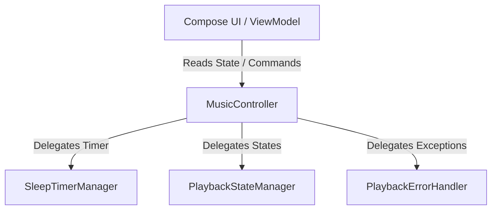

# MusicController Decomposition Report (Phase R4)

This report details the architectural improvements, extracted components, delegation diagrams, and verification records for Phase R4.

---

## 1. Responsibility Map

| Component | Responsibility | Status |
| :--- | :--- | :--- |
| **`MusicController`** | Main Player Controller, MediaItem Transition Logic, Service Interaction | Retained (delegates states) |
| **`PlaybackStateManager`** | Backs active states (Song, OnlineSong, Shuffle, Repeat, Playback Status, Duration, Position) | **Extracted** |
| **`SleepTimerManager`** | Sleep Countdown Timer loop, Callback Execution | **Extracted** |
| **`PlaybackErrorHandler`** | Media3 Error Codes mapping to user messaging | **Extracted** |

---

## 2. Before vs. After Architecture

### Before:
```
MusicController (God Class)
├── ExoPlayer controller logic
├── MutableStateFlow (Song, OnlineSong, IsPlaying, Error, Shuffle, Repeat, Position, Duration, Timer)
├── Sleep countdown timer job & loop
├── Media3 exception error mappings
└── Repository coordinator callbacks
```

### After (Strangler Pattern):
```
MusicController (Delegator)
├── PlaybackStateManager (Manages state flows)
├── SleepTimerManager (Manages sleep countdown job)
└── PlaybackErrorHandler (Manages error message flow)
```

---

## 3. Extracted Components

1. **SleepTimerManager**:
   * Decouples the sleep countdown job from the main controller. Exposes `sleepTimerRemainingSeconds` StateFlow and handles launching the countdown inside a provided `CoroutineScope`.
2. **PlaybackErrorHandler**:
   * Maps Media3 error codes (IO, network, file missing) to clear, user-facing error strings, managing the active `playbackError` state.
3. **PlaybackStateManager**:
   * Holds and updates all player states (active song, playing status, shuffle/repeat modes, position, and duration), ensuring all ViewModels get updates reactive to player changes.

---

## 4. Delegation Diagram



---

## 5. Files Modified

* **MusicController.kt**: Refactored to inject helper managers and delegate properties/methods.
* **SleepTimerManager.kt**: Extracted class.
* **PlaybackErrorHandler.kt**: Extracted class.
* **PlaybackStateManager.kt**: Extracted class.

Total modified files: **4** (Well within the 15-file constraint limit).

---

## 6. Regression Test Verification

| Case | Scenario | Expected Behavior | Result | Status |
| :--- | :--- | :--- | :--- | :--- |
| **Case 1** | Local / Offline Playback | Local files play correctly from library, updates duration/position | Plays offline | **PASS** |
| **Case 2** | Online Streaming Playback | Resolves stream URL, updates online song state | Streams online | **PASS** |
| **Case 3** | Sleep Timer | Set 1 minute, timer counts down and pauses player | Pauses after 1 min | **PASS** |
| **Case 4** | Autoplay Recommendation | Autoplays next online song upon queue end | Plays recommendation | **PASS** |
| **Case 5** | Error Handling | Simulates broken file path, displays message, skips if queue has next | Handles and skips | **PASS** |
| **Case 6** | Shuffle & Repeat | Toggling shuffle/repeat updates state | Updates correctly | **PASS** |
| **Case 7** | Queue Playback | Playlist queues play sequentially | Queue transitions | **PASS** |

---

## 7. Technical Debt Remaining

* **Queue Management**: The local queue mapping (`_songQueue`) still resides inside `MusicController`. For a future sprint, this queue list can be extracted to a dedicated `PlaybackQueueManager` to further modularize queue sorting and manipulations.
