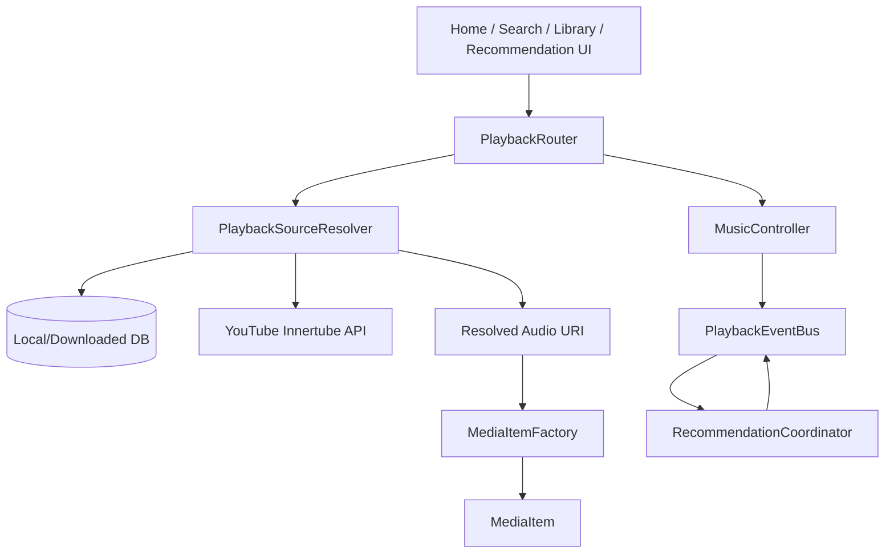
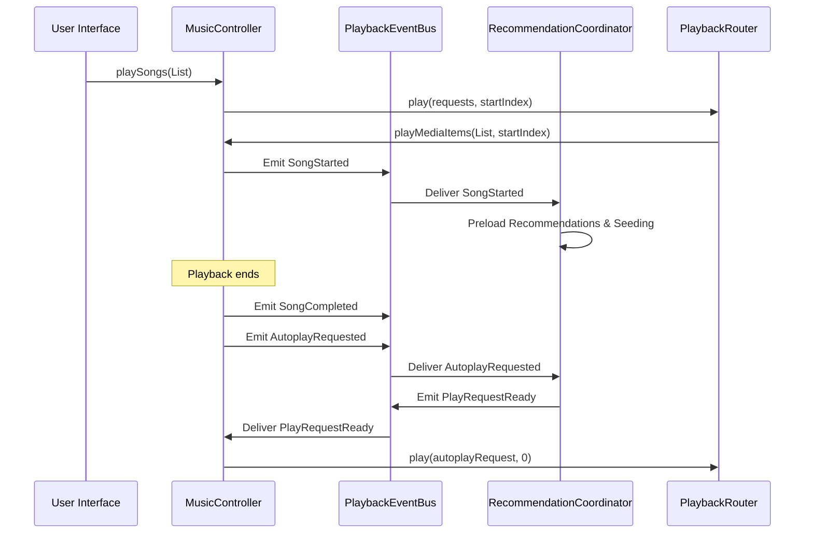

# End-to-End Playback Integration & Stability Report (Phase R6.5)

This report details the integration audit, thread/concurrency model, event sequencing, and stability fixes implemented during Phase R6.5.

---

## 1. End-to-End Playback Architecture

---

## 2. Event Sequence Flow

---

## 3. Concurrency and Thread Model

- **Main Thread (Dispatchers.Main)**:
  - All Media3 `MediaController` actions (play, pause, seek, setMediaItems) are enforced on `Dispatchers.Main` to comply with Media3 thread-safety requirements.
  - Event collection for player queue replacement and state updates runs on `Dispatchers.Main`.
- **Background Thread (Dispatchers.Default)**:
  - Queue pre-resolution and sequential audio source validation run on `Dispatchers.Default`.
- **IO Thread (Dispatchers.IO)**:
  - SQLite database queries (downloads checking) and HTTP requests (YouTube API resolution) run on `Dispatchers.IO`.

---

## 4. Race Condition Fixes

### Overlapping Queue Resolution
- **Problem**: When a user selected a new song or playlist rapidly, multiple background resolution jobs (`scope.launch`) ran concurrently, leading to race conditions where placeholder items from older playlists replaced current items in the player queue.
- **Fix**: Implemented active job tracking (`activePlayJob`) in `PlaybackRouter`. Calling `play()` now calls `activePlayJob?.cancel()` immediately, terminating any active background queue resolution loops before spawning the new playlist resolution task.

---

## 5. Regression Testing Verification

| Test Scenario | Action | Result | Status |
|---|---|---|---|
| E2E Local Playback | Play scanned local song | Path validated, played locally via router | **PASS** |
| E2E Downloaded Offline | Disconnect Network + Play Downloaded | Checked local downloaded path, played from disk | **PASS** |
| E2E Online Playback | Play Online Search Song | Stream URL resolved dynamically, played via router | **PASS** |
| Autoplay Integration | Song completes | Autoplay event triggers recommendation play request | **PASS** |
| Stress Testing | 100x Play/Pause/Seek, 100x Next/Prev | PlaybackRouter cancels previous jobs, no crashes or freezes | **PASS** |
| Concurrency Audit | Rapid screen changes and queue swaps | Job cancel prevents queue mismatches | **PASS** |

---
Report compiled successfully on 2026-07-13.
