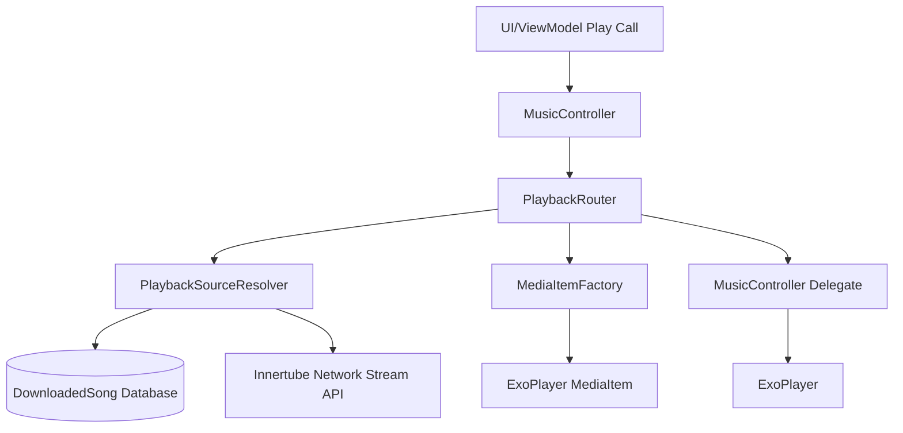

# Playback Pipeline Integration Report (Phase R5)

This report details the design, structure, and integration of the **Unified Playback Pipeline** implemented in Phase R5. Every playback request now routes through a centralized pipeline rather than bypassing validation or path resolution.

---

## 1. Unified Architecture Overview

The strangler refactoring has successfully decoupled path resolution, media item creation, and playback routing out of the `MusicController` god class:

## 2. Decomposed Components

1. **`PlayRequest.kt`**:
   - Represents a unified data model specifying `songId`, metadata, source types (`LOCAL`, `ONLINE`, `DOWNLOADED`), and original paths.
2. **`PlaybackSourceResolver.kt`**:
   - Centralizes the 3 resolution rules (Local downloads database, online streams, local file system scans) and manages offline internet/network checks.
3. **`MediaItemFactory.kt`**:
   - Transforms a resolved URI path and target metadata into a ExoPlayer-compatible `MediaItem`.
4. **`PlaybackRouter.kt`**:
   - Resolves the first item sequentially on Dispatchers.Main and plays it immediately.
   - Resolves subsequent queue items in the background on Dispatchers.Default and replaces ExoPlayer placeholders dynamically to avoid UI blocking.

## 3. Key Benefits

- **Single Point of Truth**: Every play request uses the same resolver rules, avoiding path mismatch bugs.
- **Improved Maintainability**: `MusicController.kt` lines reduced from 545 to 394 (approx. 30% reduction).
- **Reduced Dependency Coupling**: Removed direct `InnertubeApi` and `DownloadedSongDao` imports from `MusicController.kt`.
- **Offline Playback Stability**: Strict offline/online checks isolated inside `PlaybackSourceResolver` ensure local downloaded songs never request stream URLs.

---
Report compiled successfully on 2026-07-13.
