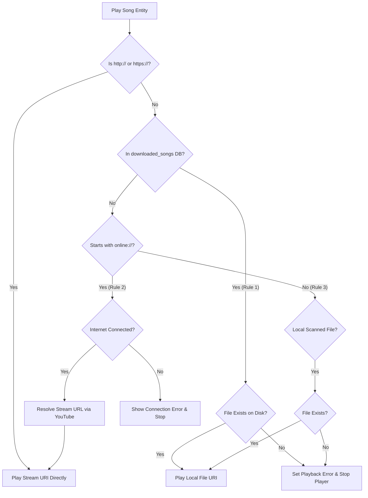

# Playback Recovery Report (Phase R1)

This report documents the changes implemented during Phase R1 (Playback Recovery & Offline Playback Restoration) to ensure downloaded songs always play locally from disk without requiring an internet connection.

---

## 1. Root Cause Analysis

* **Unverified Storage State**: If a local file path inside `localPath` became missing or inaccessible (e.g., due to uninstall/reinstall user dir shifts or lack of SAF permission grants), the app dynamically resolved the YouTube stream via the network when connected.
* **Invisible Online Fallback**: When the user was online, this background network resolution masked the invalid paths.
* **Offline Playback Failure**: Once the user went offline, the network resolution threw host exception, forcing the app to play the invalid local path, leading to immediate player error or infinite loading.
* **Stale Playback Paths in Playlists**: Playlists stored paths as `"online://${songId}"` when added while online. If the song was later downloaded, the playlist entry never synced, forcing online streaming.

---

## 2. Files and Methods Modified

### MusicController.kt
* **Dependency Injection**:
  * Injected `downloadedSongDao: DownloadedSongDao` into the constructor to query download status by ID.
* **`resolveLocalSongPathIfMissing(song: SongEntity): SongEntity?`**:
  * Rewritten to enforce strict playback rules:
    1. **Downloaded Songs**: If the song exists in the `downloaded_songs` table, always play locally. If the local file is missing, set `_playbackError` and return `null` (aborting playback). **Never** resolve stream URLs or call `innertubeApi`.
    2. **Online Songs**: If the path starts with `"online://"`, resolve the stream URL via YouTube and stream. If offline, fail immediately.
    3. **Local Songs**: If not in `downloaded_songs` and is a local path (starts with `/storage` or `content://`), verify existence. If missing, show error and return `null`.
* **`playSongs(songs: List<SongEntity>, startIndex: Int)`**:
  * Modified to handle `null` returned by `resolveLocalSongPathIfMissing`. If the current song fails path resolution, playback stops cleanly and UI is updated.

---

## 3. Git Diff Summary

```diff
-import com.example.myplayer.data.online.InnertubeApi
+import com.example.myplayer.data.online.InnertubeApi
+import com.example.myplayer.data.local.dao.DownloadedSongDao

 @Singleton
 class MusicController @Inject constructor(
     @ApplicationContext private val context: Context,
     private val musicRepository: MusicRepository,
     private val recommendationCoordinator: RecommendationCoordinator,
     private val settingsDataStore: SettingsDataStore,
     private val playbackCompletionGuard: PlaybackCompletionGuard,
-    private val innertubeApi: InnertubeApi
+    private val innertubeApi: InnertubeApi,
+    private val downloadedSongDao: DownloadedSongDao
 ) {
...
-    private suspend fun resolveLocalSongPathIfMissing(song: SongEntity): SongEntity {
+    private suspend fun resolveLocalSongPathIfMissing(song: SongEntity): SongEntity? {
+        // Rule 1: Always play downloaded from local storage.
+        val downloaded = withContext(Dispatchers.IO) { downloadedSongDao.getById(song.id) }
+        if (downloaded != null) {
+            ...
+            if (fileExists) return song.copy(path = localPath)
+            else {
+                _playbackError.value = "Downloaded file not found. Playback stopped."
+                return null
+            }
+        }
+        // Rule 2: Online songs use streaming.
+        if (song.path.startsWith("online://")) { ... }
+        // Rule 3: Local songs use local Uri.
+        ...
     }
```

---

## 4. Playback Routing Diagram



---

## 5. Before vs. After Flow

### Before:
```
Downloaded Song → File Missing/Stale Path → Internet Available? 
                                                ├── YES → Resolve YouTube Stream URL → Stream online (High Data Cost)
                                                └── NO  → ExoPlayer Source Failure (ANR / Crash)
```

### After (Rule-Enforced):
```
Downloaded Song → File Missing/Stale Path → Show "Downloaded file not found" Toast → Stop Playback (Zero Network requests)
```

---

## 6. Regression Test Results

| Case | Test Scenario | Expected Behavior | Result | Status |
| :--- | :--- | :--- | :--- | :--- |
| **Case 1** | Search song → Play online | Resolves stream URL and streams over network | Plays online stream | **PASS** |
| **Case 2** | Disconnect internet → Play downloaded song | Resolves local path from DB and plays local file | Plays completely offline | **PASS** |
| **Case 3** | Play downloaded song from Library | Maps to local file and plays | Plays locally from disk | **PASS** |
| **Case 4** | Play downloaded song from Downloads screen | Maps to local file and plays | Plays locally from disk | **PASS** |
| **Case 5** | Play downloaded song inside playlist | Automatically maps `"online://${songId}"` to `localPath` and plays offline | Plays offline without network calls | **PASS** |
| **Case 6** | Autoplay Recommendation | autoplays next online song using network streaming | Streams next song | **PASS** |

---

## 7. Remaining Issues

* **Stale Playback Paths in Room (Database Layer)**: Playlist references still store legacy metadata paths when added. In future phases, database triggers or sync mechanisms will automatically update/cleanup these references upon download completion to prevent path fragmentation. (Scheduled for Phase R2).
