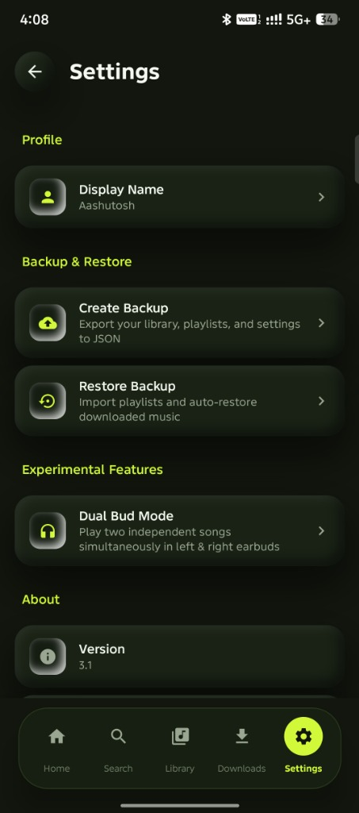
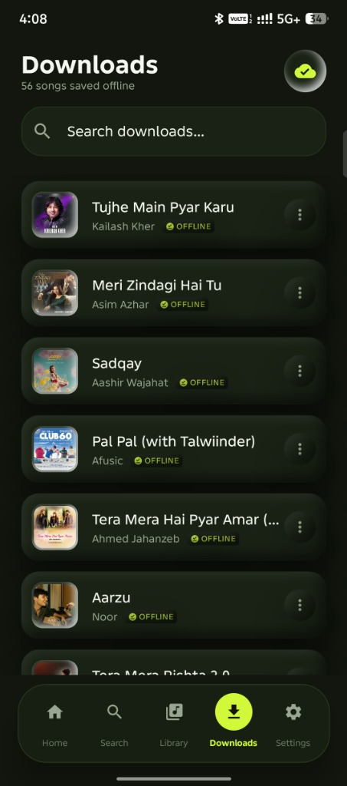
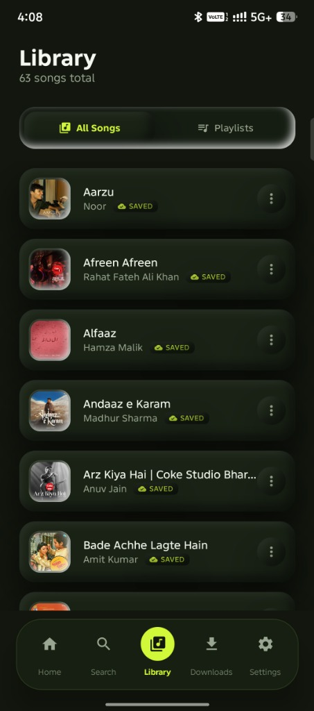
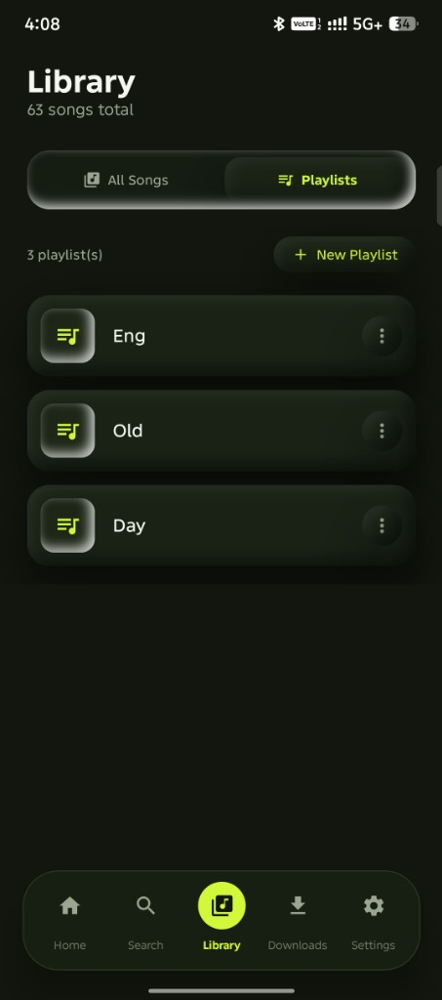
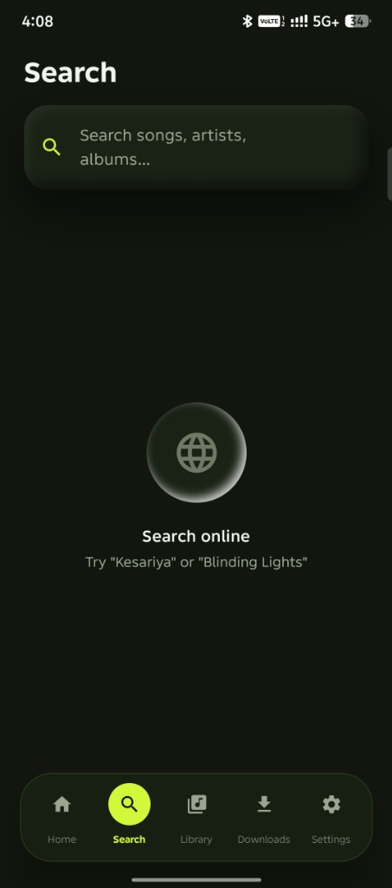

# 🎵 MyPlayer

<div align="center">


<p align="center">
  <b>A modern, high-performance Android music player combining local library playback, seamless online streaming, intelligent recommendations, real-time synchronized lyrics, innovative dual-earbud playback, and an ultra-modern Dark Olive & Electric Neon Lime design system.</b>
</p>

</div>

---

## 🌟 Highlights & Key Features

- **🎨 Modern Dark Olive & Electric Neon Lime Aesthetic (v3.1)**: An immersive dark theme featuring deep olive-charcoal backgrounds (`#12160E`), sleek surfaces (`#1A2216`), and vibrant electric neon lime accents (`#D2F83A`).
- **🌀 Signature Radial Audio Controller**: Interactive 270° circular seek arc supporting smooth touch and drag scrubbing, surrounded by concentric glowing aura sound rings and an apex favorite heart button.
- **👤 Personalized User Profile & Display Name**: Set and personalize your display name right from the Home Screen or via the dedicated Profile section in Settings, persistently backed by Jetpack DataStore.
- **🏷️ Interactive Category & Mood Filter Pills**: Instant genre and mood filter pills ("All", "Party", "Blues", "Sad", "Hip Hop", "Chill", "Workout", "Pop") for quick library exploration.
- **🔥 Popular Songs Carousel & Featured Collection Banners**: Dynamic horizontal song carousels with studio artwork, playing equalizer badges, and featured gradient banners.
- **🎧 Dual Bud Mode**: Play two separate, independent audio streams simultaneously—one in your left earbud and another in your right earbud with individual volume controls!
- **🌐 Hybrid Playback Engine**: Seamlessly switch between local device storage and online YouTube Music streaming through a unified Media3 / ExoPlayer pipeline.
- **🖼️ 1000×1000 HD Artwork Engine**: Multi-tier artwork resolution integrating iTunes Search API, Deezer API, and YouTube Music to automatically fetch studio-grade HD album covers.
- **📜 Synced Lyrics**: Real-time synchronized lyrics powered by LRCLIB with silky smooth auto-scrolling and manual line scrubbing.
- **🧠 Smart Recommendations & Autoplay**: Dynamic next-song recommendation engine that surfaces contextual tracks based on current playback genres and artists.
- **💾 Offline Downloads & Backup**: Download online audio directly to local storage for offline playback, and export/import full library and playlist states using JSON backup & restore.
- **🛡️ Clean Navigation Architecture**: Mini player and floating pill navigation bar docked within Scaffold's bottomBar, eliminating z-index overlapping and preventing obscured content.

---

## 📸 Screenshots

<div align="center">
  <h3>✨ Design Overview & Hero Radial Controller</h3>
  
</div>

<br/>

<div align="center">
  <h3>📱 App Screens (v3.1)</h3>
  <table align="center">
    <tr>
      <td align="center" width="20%">
        <b>Settings & Profile</b><br/>
        
      </td>
      <td align="center" width="20%">
        <b>Downloads Screen</b><br/>
        
      </td>
      <td align="center" width="20%">
        <b>Library (All Songs)</b><br/>
        
      </td>
      <td align="center" width="20%">
        <b>Library (Playlists)</b><br/>
        
      </td>
      <td align="center" width="20%">
        <b>Online Search</b><br/>
        
      </td>
    </tr>
  </table>
</div>

---

## 🆕 What's New in Version 3.1

1. **Brand-New Stitch UI**:
   - Complete redesign inspired by the Stitch design specification (`ui.webp`).
   - Deep organic olive-black palette with electric neon lime interactive accents.
2. **Radial Seek & Audio Controller**:
   - Circular seek arc replacing standard linear seekbars on the Now Playing screen.
   - Pulsing concentric sound waves responding to active playback.
3. **Personalized User Profile**:
   - Display name customization in both Settings and Home Screen.
   - Persistent preferences storage using AndroidX DataStore.
4. **Docked Navigation & Floating Pill**:
   - Fixed navigation bar and mini player z-index positioning inside `Scaffold`'s `bottomBar`.
   - Floating pill navigation bar with active neon lime circle indicator.
5. **Streamlined Library**:
   - Removed folder view clutter; consolidated into clean "All Songs" and "Playlists" tabs.
6. **High-Fidelity Audio Stream Badges**:
   - Lossless and Hi-Res fidelity pill indicators showing bit depth, sample rate, and codec format.

---

## 🏗️ Architecture & Technology Stack

MyPlayer is engineered following **Clean Architecture** principles and the **MVVM** pattern with strict Unidirectional Data Flow (UDF).

| Layer | Technologies / Libraries |
| :--- | :--- |
| **Language** | [Kotlin](https://kotlinlang.org/) (Coroutines, StateFlow, Flow) |
| **UI Toolkit** | [Jetpack Compose](https://developer.android.com/jetpack/compose) with Material 3 & Custom Design Tokens |
| **Audio Core** | [AndroidX Media3](https://developer.android.com/guide/topics/media/media3) (`ExoPlayer`, `MediaSession`, `MediaController`) |
| **Dependency Injection** | [Hilt](https://developer.android.com/training/dependency-injection/hilt-android) / Dagger |
| **Local Persistence** | [Room Database](https://developer.android.com/training/data-storage/room) & Jetpack DataStore |
| **Networking** | [OkHttp3](https://square.github.io/okhttp/) & [Retrofit](https://square.github.io/retrofit/) |
| **Image Loading** | [Coil](https://coil-kt.github.io/coil/) (Asynchronous image loading & disk caching) |
| **Paging** | AndroidX Paging 3 |

---

## 📁 Repository Structure

```text
MyPlayer/
├── app/
│   ├── src/
│   │   ├── main/
│   │   │   ├── java/com/example/myplayer/
│   │   │   │   ├── data/            # Room entities, DAOs, Repositories, Artwork & Lyrics APIs
│   │   │   │   ├── di/              # Hilt Dependency Injection modules
│   │   │   │   ├── dualbud/         # Dual-channel audio routing & earbud mixer
│   │   │   │   ├── playback/        # Media3 MusicController, Service & Source Resolvers
│   │   │   │   ├── security/        # Integrity and runtime security verification
│   │   │   │   ├── ui/              # Compose screens, components, theme & navigation
│   │   │   │   └── util/            # Helpers and background art fetchers
│   │   │   └── res/                 # Vector drawables, mipmaps, XML security configs
│   │   └── test/                    # Comprehensive unit tests (Artwork, Playback, Queue, etc.)
│   └── build.gradle.kts
├── docs/                            # Architectural design documents & screenshots
│   └── screenshots/                 # High-resolution screenshots and UI design specs
├── gradle/                          # Gradle wrapper and version catalog (libs.versions.toml)
├── CONTRIBUTING.md                  # Open source contribution guidelines
├── LICENSE                          # MIT Open Source License
└── README.md
```

---

## 🚀 Getting Started

### Prerequisites

- **Android Studio Koala (2024.1.1)** or newer
- **JDK 17** or **JDK 21** (or Android Studio Embedded JBR)
- Android SDK with:
  - `compileSdk`: **35**
  - `minSdk`: **26** (Android 8.0 Oreo)
  - `targetSdk`: **34**

### Clone & Build

1. Clone the repository:
   ```bash
   git clone https://github.com/Aashutosh2021/MyPlayer.git
   cd MyPlayer
   ```

2. Open the project in Android Studio, or build via the command line:
   ```bash
   ./gradlew assembleDebug
   ```

3. Run the unit test suite:
   ```bash
   ./gradlew testDebugUnitTest
   ```

---

## 🤝 Contributing

Contributions are warmly welcome! Whether it's reporting a bug, improving documentation, or proposing new features:

1. Check open issues or create a new discussion.
2. Fork the repository and create a feature branch (`git checkout -b feature/amazing-feature`).
3. Commit your changes and ensure all tests pass (`./gradlew testDebugUnitTest`).
4. Submit a Pull Request targeting `main`.

Please review our [Contribution Guide](CONTRIBUTING.md) for details on code style and architecture practices.

---

## 📄 License

This project is open-sourced under the [MIT License](LICENSE).

