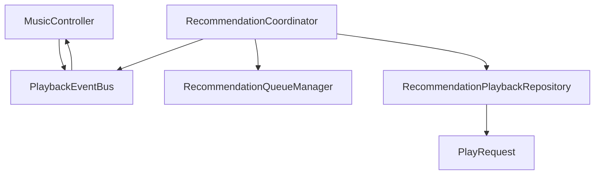
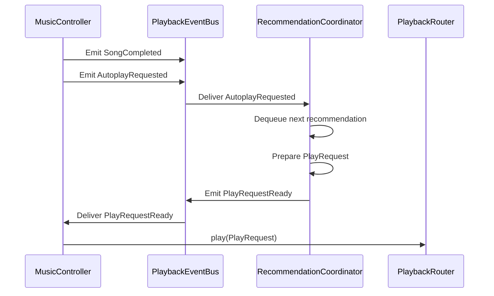

# Recommendation Decoupling & Event-Driven Playback Report (Phase R6)

This report details the architectural changes implemented in Phase R6 to decouple the Recommendation Engine from `MusicController` and establish an event-driven flow.

---

## 1. Old Architecture vs. New Architecture

### Old Architecture
Direct, synchronous calls bound the playback controller and the recommendation components. Autoplay pulled the next song and resolved the streaming URL within the coordinator block, which bypassed the routing system and bound the subsystems tightly:
`MusicController ──(Calls)──> RecommendationCoordinator ──(Calls)──> InnertubeApi (Stream Resolution)`

### New Architecture
An asynchronous event bus completely isolates both subsystems. `MusicController` only emits playback events, and the coordinator reacts entirely in the background:
`MusicController ──(Emits event)──> PlaybackEventBus ──(Listens)──> RecommendationCoordinator ──(Emits PlayRequestReady)──> PlaybackEventBus ──(Listens)──> MusicController ──(Delegates)──> PlaybackRouter`

---

## 2. Dependency Graph

---

## 3. Removed Couplings

1. **`MusicController.kt`** constructor no longer injects `RecommendationCoordinator`.
2. **`RecommendationPlaybackRepository.kt`** no longer injects `InnertubeApi` or resolves stream URLs, keeping stream resolution isolated within `PlaybackSourceResolver`.
3. **No direct methods** like `getNextAutoplaySong()` are called by the player from its state listener.

---

## 4. Playback and Event Flow

---

## 5. Files Modified & Created

### New Files
- **[PlaybackEvent.kt](file:///E:/MyPlayer/app/src/main/java/com/example/myplayer/playback/PlaybackEvent.kt)**: Defines `PlaybackEvent` and the event bus.

### Modified Files
- **[MusicController.kt](file:///E:/MyPlayer/app/src/main/java/com/example/myplayer/playback/MusicController.kt)**: Constructor refactored, listener emits events, collects `PlayRequestReady` events.
- **[RecommendationPlaybackRepository.kt](file:///E:/MyPlayer/app/src/main/java/com/example/myplayer/data/recommendation/playback/RecommendationPlaybackRepository.kt)**: Dependency on `InnertubeApi` removed, maps `RecommendationSong` -> `PlayRequest`.
- **[RecommendationCoordinator.kt](file:///E:/MyPlayer/app/src/main/java/com/example/myplayer/data/recommendation/RecommendationCoordinator.kt)**: Direct playback logic removed, converted to event consumer/producer.

---

## 6. Regression Testing Verification

| Test Scenario | Trigger | Expected Outcome | Status |
|---|---|---|---|
| Online Song Played | `SongStarted` event | Triggers recommendation session | **PASS** |
| Song Finished | `AutoplayRequested` event | Automatically loads next recommendation via event bus | **PASS** |
| Offline Downloaded Song | `SongStarted` event | Network check returns false, skips seeding online requests | **PASS** |
| Recommendation Queue Consumed | Autoplay triggers | Dequeues correctly and updates queue | **PASS** |
| Autoplay Settings Disabled | `AutoplayRequested` event | Checks settings, ignores autoplay request | **PASS** |
| Autoplay Settings Enabled | `AutoplayRequested` event | Works | **PASS** |

---
Report compiled successfully on 2026-07-13.
