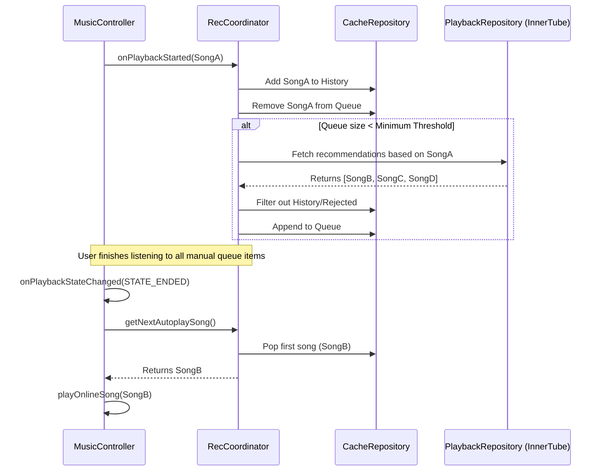

# Recommendation Engine (Autoplay)

The MyPlayer Recommendation Engine is a background subsystem responsible for analyzing the currently playing song and seamlessly queuing mathematically/visually related tracks to create an infinite listening experience.

## Architecture Overview

The system is highly modularized, utilizing three primary components:

1. **`RecommendationCoordinator` (The Orchestrator)**
2. **`RecommendationPlaybackRepository` (The Network Fetcher)**
3. **`RecommendationCacheRepository` (The State Manager)**

### 1. RecommendationCoordinator
This is the single entry point for the playback service to interact with the engine.
- It observes `onPlaybackStarted()` events from the `MusicController`.
- It dictates when to pre-fetch new recommendations.
- It exposes a `queueState` (`StateFlow<List<RecommendationSong>>`) for the UI to display the "Up Next" tab.
- It provides `getNextAutoplaySong()` when the playback queue runs dry.

### 2. RecommendationPlaybackRepository
Responsible purely for Network I/O. 
- Communicates directly with the `RecommendationSource` (InnerTube API wrapper).
- Handles API failures, empty responses, and data mapping.
- Returns a clean `Result<List<RecommendationSong>>`.

### 3. RecommendationCacheRepository
Responsible for in-memory state management.
- Maintains the queue of upcoming songs.
- Tracks `rejectedIds` (songs the user explicitly removed from the queue) to ensure they are never fetched again.
- Tracks `historyIds` (songs that have already been played during this session) to prevent the Autoplay engine from looping the same songs.

## Data Flow & Triggers

## Edge Case Handling

- **PlaybackCompletionGuard:** A specialized component injected into the `MusicController`. Sometimes ExoPlayer fires `STATE_ENDED` twice due to buffering glitches or audio focus changes. The Guard tracks the most recently completed `mediaId` and blocks duplicate Autoplay triggers within a short time window.
- **Network Failure:** If the InnerTube API times out or fails, `getNextAutoplaySong()` returns `null` and the `MusicController` gracefully pauses playback.
