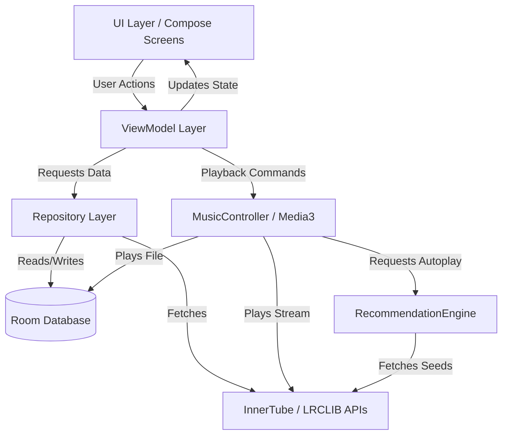

# Architecture

MyPlayer is built on a strict **Model-View-ViewModel (MVVM)** architecture combined with **Unidirectional Data Flow (UDF)**. It leverages modern Android development paradigms, specifically Kotlin Coroutines, StateFlow, Hilt (Dependency Injection), and Jetpack Compose.

## High-Level Diagram

---

## 1. UI Layer (Jetpack Compose)
The UI is 100% Jetpack Compose. It strictly observes state from ViewModels using `collectAsStateWithLifecycle()` to ensure UI components only re-compose when active and visible, saving battery and CPU. 
The UI layer pushes user intents (clicks, typing, scrubbing) down to the ViewModel. It contains NO business logic.

## 2. ViewModel Layer
ViewModels act as the bridge between the UI and the Repositories/MusicController. They expose immutable `StateFlow` to the UI and receive events. They launch coroutines in `viewModelScope` to perform background operations asynchronously.

Key ViewModels:
- `MainViewModel`: Global state (current song, playback state, navigation state).
- `NowPlayingViewModel` / `LyricsViewModel`: Playback controls, seek state, and real-time lyric fetching/syncing.
- `RecommendationViewModel`: Exposes the queue of upcoming Autoplay recommendations.

## 3. Repository Layer
Repositories provide a single source of truth for data. They abstract away the origin of the data (Network vs Database).

Key Repositories:
- `MusicRepository`: Handles local device scanning and Room database interactions.
- `LyricsRepository`: Manages LRCLIB API calls, parsing LRC strings, and caching logic.
- `RecommendationPlaybackRepository` / `RecommendationCacheRepository`: Modular components of the recommendation engine that handle network requests to YouTube's InnerTube API and local state caching.

## 4. Playback Layer (Media3)
The heart of the application is the `MusicController`, a Singleton wrapping AndroidX Media3 (`MediaController` and `MediaSession`).

- **Unified Interface:** It accepts a `PlayableSong` interface, allowing it to seamlessly transition between local MP3s and online YouTube audio streams.
- **Thread Safety:** `MediaController` APIs are strictly bound to `Dispatchers.Main`. Any heavy database or network lookups performed during playback (like Autoplay resolution) are dispatched to `Dispatchers.IO` using `withContext` to prevent UI thread blocking.
- **Service Integration:** Operates in conjunction with `MusicService` (a Foreground Service) to keep playback alive while the app is in the background or the screen is off.

## 5. Recommendation Engine
The Recommendation Engine is a background subsystem initialized by the `RecommendationCoordinator`.
- When a song plays, the Coordinator feeds the `RecommendationEngine` with a seed.
- The Engine queries the InnerTube API on `Dispatchers.IO`.
- Results are cached and exposed as a queue.
- When `MusicController` reaches `Player.STATE_ENDED`, it queries the Coordinator for the next song, creating a seamless infinite Autoplay loop.

## 6. Dependency Injection (Hilt)
Hilt manages the lifecycle and provision of all major components. 
- Repositories and `MusicController` are scoped as `@Singleton`.
- ViewModels are scoped via `@HiltViewModel`.
- API Services (OkHttp, Retrofit) are provided via dedicated Dagger Modules.

---

For more detailed technical breakdowns, please see the documents in the `docs/` directory.