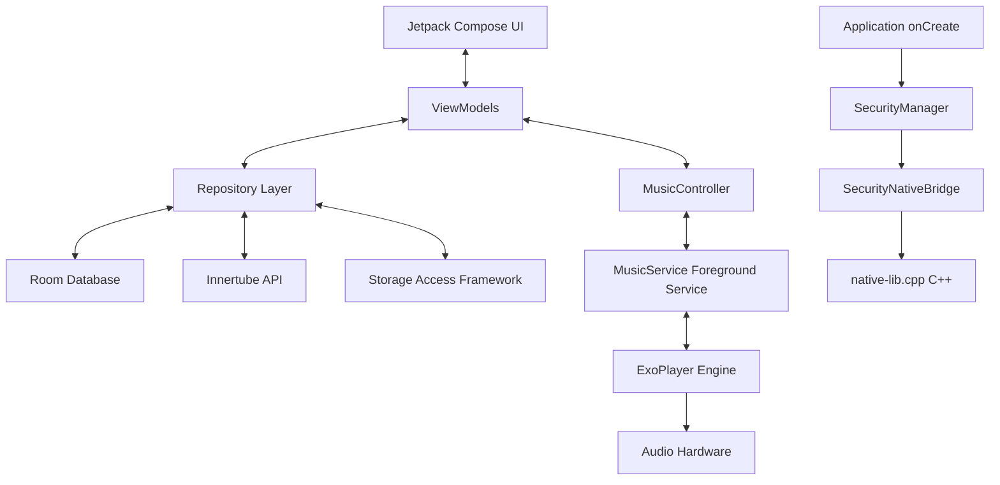
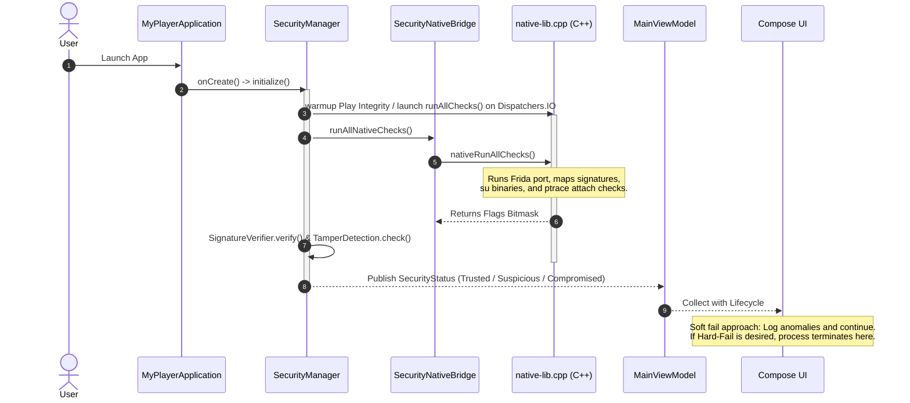
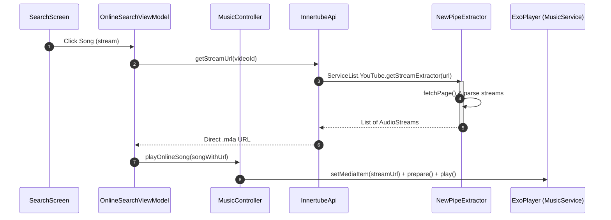
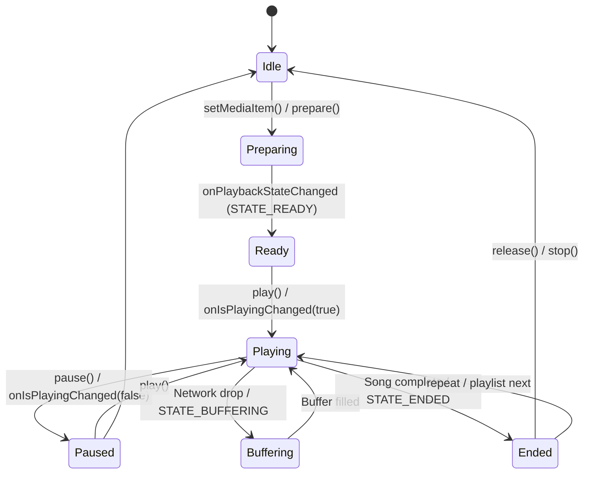

# Architecture & System Design - MyPlayer

This document outlines the detailed system architecture, layer interfaces, component interactions, startup execution paths, and playback lifecycle transitions of the **MyPlayer** application.

---

## 1. High-Level Architecture Overview

MyPlayer is constructed as a **Model-View-ViewModel (MVVM)** application. The system decouples UI composition from business logic, data scanning, network endpoints, and background audio execution.

---

## 2. Component & Layer Architecture

### UI Layer (Composables & ViewModels)
* **MainScreen / MainViewModel**: Serves as the primary navigation host and mini-player controller. It coordinates global player state and reactive details.
* **NowPlayingScreen**: Renders full-screen details, metadata, timeline slider, and sleep timer overlay.
* **Sub-Screens**: `HomeScreen` (local dashboard), `SearchScreen` (online/local search), `LibraryScreen` (playlists/folders/favorites), and `DownloadsScreen` (sideloaded web audio).
* **Glass/Clay Components**: Custom buttons, progress bars, and navigation items defined in `GlassComponents.kt` utilizing `.claySurface()` modifiers.

### Domain/Repository Layer
* **MusicRepository**: Acts as the offline library gateway. It interacts with `SongDao`, `PlaylistDao`, `FavoriteDao`, `FolderDao`, `RecentHistoryDao`, and orchestrates local directory importing via `MediaScanner`.
* **OnlineSearchRepository**: Handles query dispatching. It couples the remote `InnertubeApi` with the local `RecentSearchDao` cache, presenting results via Jetpack Paging 3.
* **HybridLibraryRepository**: Merges offline songs (`SongEntity`) and online downloads (`DownloadedSongEntity`) into a unified, alphabetical stream of `PlayableSong` items.
* **DownloadRepository**: Drives background workers. It enqueues download tasks into `WorkManager` and tracks download progress states in-memory.

### Data Layer
* **AppDatabase**: The local Room Database containing 8 entity types.
* **InnertubeApi / NewPipeDownloader**: The remote HTTP client interface for YouTube Music query parsing.
* **NewPipeExtractor**: Evaluates YouTube watch links and decodes streaming signatures to extract direct `.m4a` and `.webm` links.

### Playback & Service Layer
* **MusicService**: Extends Media3's `MediaSessionService`. It runs in the foreground with an active notification, managing the `ExoPlayer` instance.
* **MusicController**: Acts as the central singleton manager. It wraps the asynchronous `MediaController` link to `MusicService` and exposes StateFlow flows (`isPlaying`, `currentSong`, `currentPosition`, etc.) to the UI.

---

## 3. Startup and Security Flow

At application launch, MyPlayer executes structural and security integrity verification before letting users stream or access files.

---

## 4. Key Execution flows

### Online Search & Streaming Request Flow
1. User types in search bar -> debounced flow triggers query.
2. `SearchViewModel` calls `OnlineSearchRepository.search(query)`.
3. `InnertubeSearchPagingSource` executes search against `InnertubeApi` on `Dispatchers.IO`.
4. API executes POST `/search` using decrypted keys from `StringEncryptionManager`.
5. Paging 3 flows list of `OnlineSong` objects back to `SearchScreen`.
6. User clicks play -> `OnlineSearchViewModel.streamSong(song)` is executed.
7. `InnertubeApi.getStreamUrl(videoId)` invokes `NewPipeExtractor.getStreamExtractor()`.
8. Extractor connects, decodes signatures, and returns the direct `.m4a` URL.
9. `MusicController.playOnlineSong(song)` updates the player queue, loads the URL into ExoPlayer, and triggers `.play()`.

### Background Download Flow
1. User clicks download on an `OnlineSong`.
2. `OnlineSearchViewModel.downloadSong(song)` fetches the direct stream URL.
3. `DownloadRepository.startDownload()` enqueues an **Expedited Work Request** to `WorkManager` using `DownloadWorker`.
4. `DownloadWorker` transitions to a foreground task, displaying a persistent download progress notification.
5. Worker reads custom download directory Uri from `PreferencesManager` (DataStore).
6. Worker makes chunked OkHttp requests to the stream URL using an Android User-Agent header to bypass YouTube's content throttling.
7. Bytes are written to a temporary `.tmp` file.
8. Once download is complete, the file is renamed to `.m4a` inside the destination folder.
9. Worker inserts a new `DownloadedSongEntity` record into the local Room database.
10. `DownloadedSongDao` publishes an updated list flow, which refresh-updates the `DownloadsScreen` UI.

---

## 5. Playback Lifecycle

The audio playback lifecycle is managed by Media3 and Android OS rules:

* **Foreground Service Promotion**: The `MusicService` transitions to a foreground service when ExoPlayer starts playing, ensuring playback survives background app lifecycle suspensions.
* **Task Swiped Away**: If the user swipes the app away from recent apps, `MusicService.onTaskRemoved()` stops the service if the player is currently paused or ended, avoiding battery leaks.
