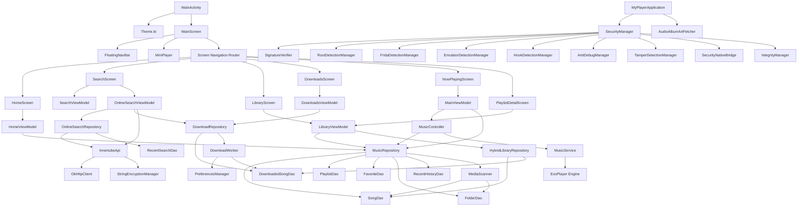
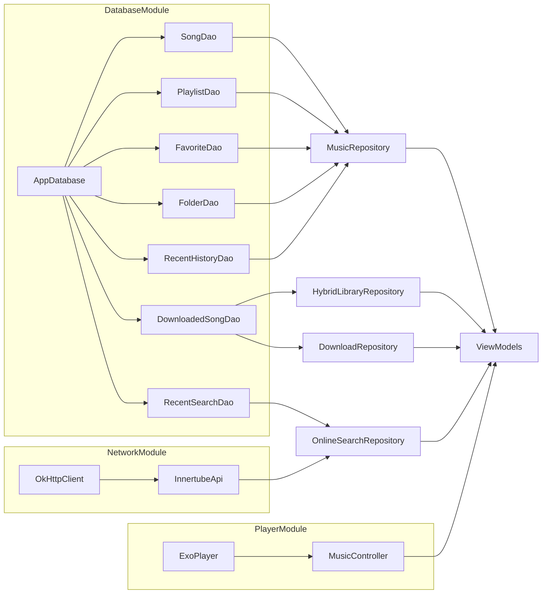
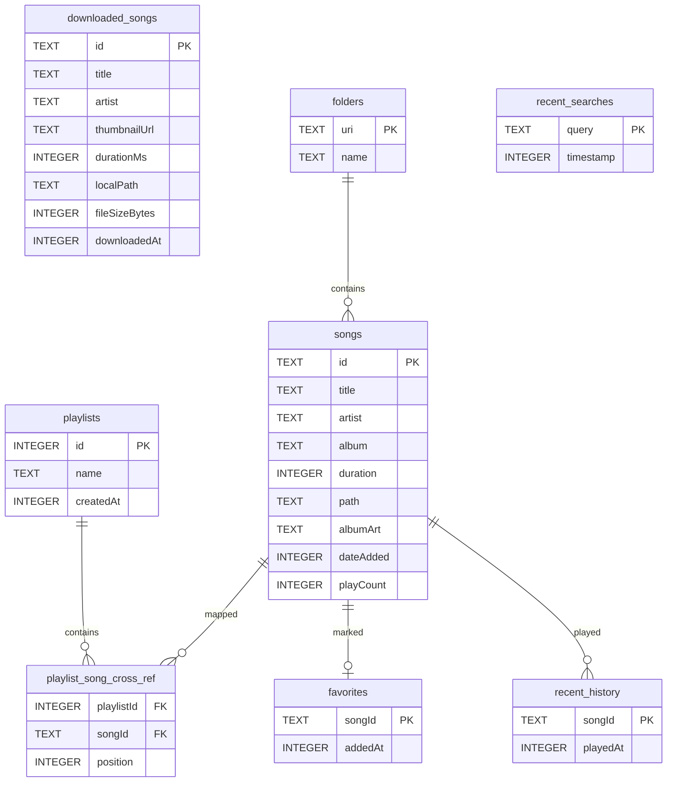

# Dependency Graph - MyPlayer

This document visualizes the class, package, database, and dependency injection relationships within the **MyPlayer** codebase.

---

## 1. Class-Level Structural Dependency Graph

This diagram shows how major classes depend on one another. Arrows denote "depends on" or "references" direction.

---

## 2. Dependency Injection Injections (Hilt)

Hilt manages the instantiation of core application singletons and databases. The graph below maps how modules supply types to classes.

---

## 3. SQLite Schema Relations (Room Database)

This graph displays the foreign keys and cross-references of the local Room Database tables.

