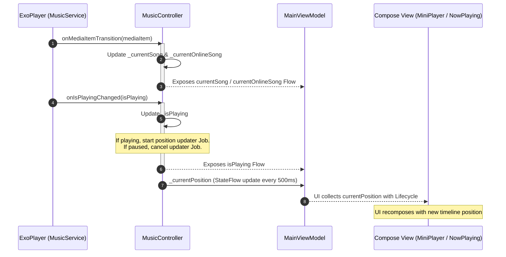
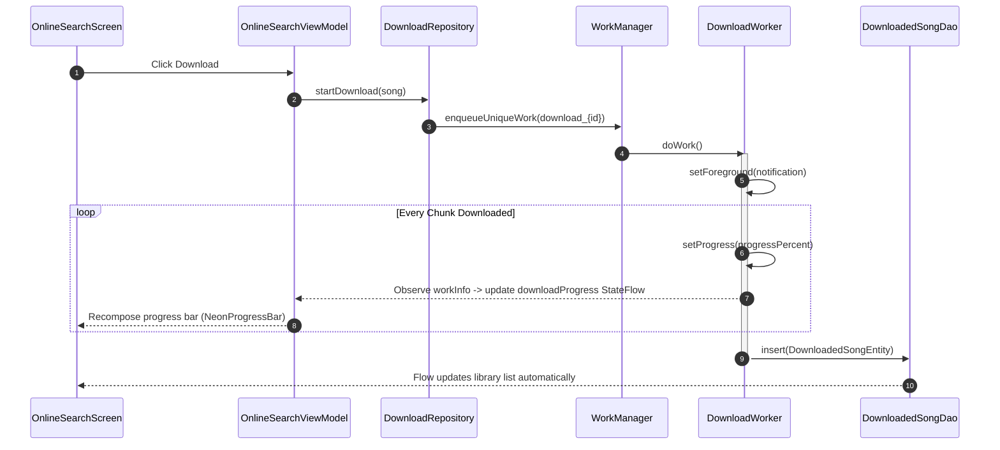
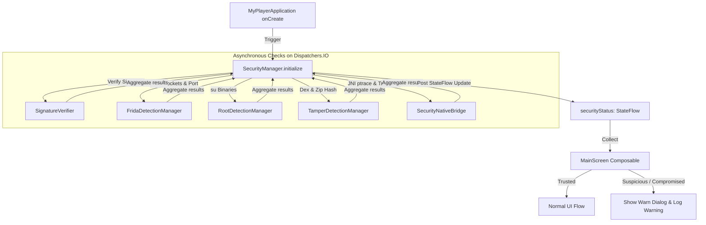

# Event Graph - MyPlayer

This document maps the reactive event flows, state updates, progress triggers, and callback structures that drive the **MyPlayer** UI and background components.

---

## 1. Playback State Broadcast Flow

When ExoPlayer transitions or changes status, it triggers callbacks that update global `StateFlow` structures:



---

## 2. Background Download Events Flow

Downloads are requested in the UI and executed in the background. Progress updates are piped back using WorkManager's `setProgress` and `DownloadRepository`:



---

## 3. Security Status Event Flow

Security integrity checks run once at application boot and report states asynchronously:



---

## 4. Database Mutations & Flow Updates

Room uses SQLite triggers to update flows. ViewModels observe these flow streams:

```
[User action] 
      ↓
[MusicRepository.toggleFavorite()] 
      ↓
[FavoriteDao.addFavorite()] 
      ↓
[SQLite DB write] 
      ↓ (Automatic Table Observer Trigger)
[FavoriteDao.getFavoriteSongs(): Flow] 
      ↓
[LibraryViewModel.favoriteSongs: StateFlow] 
      ↓ (Compose Recomposition)
[LibraryScreen UI updates list]
```
