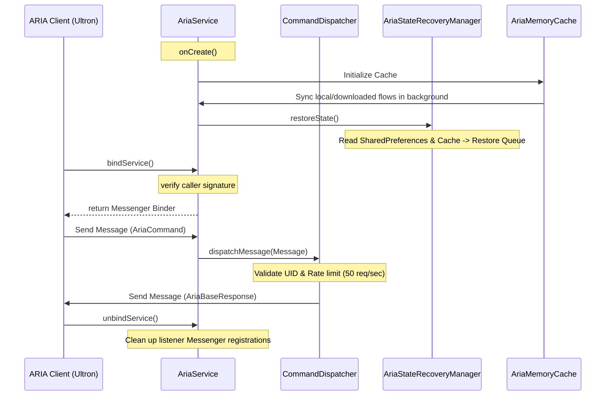

# ARIA Music SDK — Architecture & Hardening Document

This document outlines the lifecycles, execution models, security policies, and performance strategies of MyPlayer's hardened IPC Service.

---

## 1. Service Lifecycle



---

## 2. IPC Message Routing & Flow

```
[ARIA Client] ─────────► [AriaService] ─────────► [CommandDispatcher]
                                                         │
                                        +────────────────┼────────────────+
                                        │ (Validate)     │ (Rate Limit)   │ (Permission)
                                        ▼                ▼                ▼
                                  [Playback]        [Downloads]      [Metadata]
                                  [Search]          [Lyrics]         [Playlist]
                                  [Queue]           [History]        [Recommendation]
```

All IPC transactions pass through a dual-level security gate:
1. **Signature-level Connection Permission**: Verified at bind time and request time.
2. **Fingerprint Match Verification**: Compares SHA-256 signatures from the calling UID against a compile-time allowlist and debug configurations.

---

## 3. Playback State Recovery Flow

When the `AriaService` is active, it observes ExoPlayer state transitions (current track, index, position, repeat/shuffle) and writes changes to private SharedPreferences.

```
[Process Death / Restart]
           │
           ▼
[AriaService.onCreate]
           │
           ▼
[AriaStateRecoveryManager.restoreState]
           │
           ▼
Query [AriaMemoryCache] for SongEntities (0ms SQLite latency)
           │
           ▼
Rebuild playlist queue & call mediaController.seekTo(index, position)
           │
           ▼
Pause playback (Prepare state silently without autoplaying)
```

---

## 4. Performance Monitoring

The `AriaPerformanceMonitor` tracks average execution and latency statistics for all SDK requests:
- **`cache_read`**: Reads song metadata from memory maps in **<1ms**.
- **`database_read`**: Database read latency for non-cached queries.
- **`online_search` / `local_search`**: Search query speed diagnostics.
- **`dispatcher_throughput`**: End-to-end command processing speed.
- **`GET_HEALTH`**: Evaluates active system specs, JVM memory consumption, capabilities, and average command latencies.
